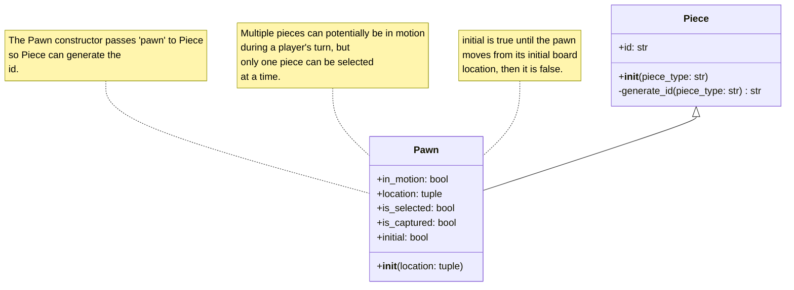

```mermaid
classDiagram
    direction TB

    class Piece {
        +id: str
        +__init__(piece_type: str)
        -generate_id(piece_type: str) str
    }

    class Pawn {
        +in_motion: bool
        +location: tuple
        +is_selected: bool
        +is_captured: bool
        +initial: bool
        +__init__(location: tuple)
    }

    Piece <|-- Pawn

    note for Pawn "The Pawn constructor passes 'pawn' to Piece<br/>so Piece can generate the<br/>id."
    note for Pawn "Multiple pieces can potentially be in motion<br/>during a player's turn, but <br/>only one piece can be selected <br/>at a time."
    note for Pawn "initial is true until the pawn <br/>moves from its initial board <br/>location, then it is false."
```