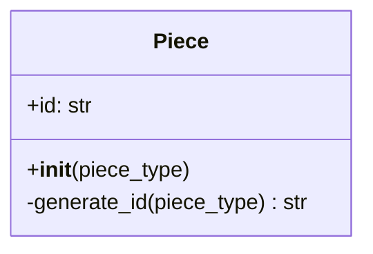
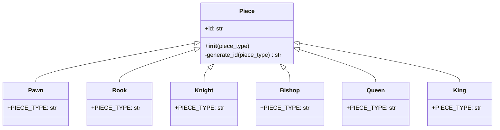

# Piece Class Design

## Purpose

`Piece` is the base class for every chess piece. It contains information and behavior that are universal to all pieces.

At this stage, the only universal instance field is `id`. The ID distinguishes pieces of the same type, such as multiple pawns, rooks, knights, bishops, or queens.

## ID format

Each ID combines the piece type with a randomly generated hexadecimal value:

```text
<piece-type>-<random-hex>-<team>
```

Examples:

```text
pawn-a3f91c20-0
rook-07bd42ef-1
knight-c218ea74-0
```

The examples use eight hexadecimal characters. In Python, that value can be generated with `secrets.token_hex(4)` because four random bytes produce eight hexadecimal characters.

The intended generation rule is:

classDiagram
    class Piece {
        +id: str
        +__init__(piece_type)
        -generate_id(piece_type) str
    }

    note for Piece "ID format: piece_type-random_hex"

## Detailed `Piece` class



- `id` is the generated identifier stored by every piece.
- `piece_type` is supplied during construction by the concrete piece class.
- `generate_id()` combines the normalized piece type, a hyphen, and random hexadecimal characters, hyphen, team.
- The leading `-` marks `generate_id()` as an internal implementation method in the design.

## Piece inheritance hierarchy



Each concrete class inherits `id` and the ID-generation behavior from `Piece`. The concrete class supplies its own piece type, which becomes the first portion of the ID.

For example, constructing four pawns could produce:

```text
Team 0
_______________________
Pawn 1: pawn-a3f91c20-0
Pawn 2: pawn-94de017b-0

Team 1
_______________________
Pawn 1: pawn-a3f91c20-1
Pawn 2: pawn-94de017b-1
```

initial generation of all piece ids, at beginning of the game, may look like

```text
pawn-d2eb9-0
pawn-73119-1
pawn-09e22-0
pawn-50cd0-1
pawn-61f90-0
pawn-76104-1
pawn-241fc-0
pawn-5f658-1
pawn-368a1-0
pawn-f754c-1
pawn-efd15-0
pawn-7aa93-1
pawn-b3dec-0
pawn-41495-1
pawn-d6c2b-0
pawn-53bad-1
king-2a26c-0
king-2343a-1
queen-39ad7-0
queen-47502-1
rook-c491b-0
rook-2e876-1
rook-3248e-0
rook-96eb8-1
knight-0d3fa-0
knight-8aea5-1
knight-16f0d-0
knight-7ca08-1
bishop-c79d3-0
bishop-9487c-1
bishop-5dc01-0
bishop-7f7b6-1
```