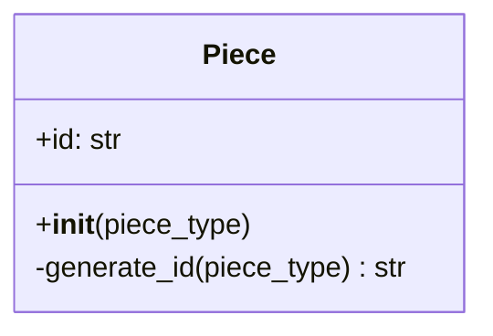
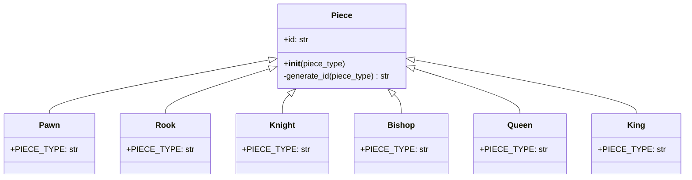

# Piece Class Design

## Purpose

`Piece` is the base class for every chess piece. It contains information and behavior that are universal to all pieces.

At this stage, the only universal instance field is `id`. The ID distinguishes pieces of the same type, such as multiple pawns, rooks, knights, bishops, or queens.

## ID format

Each ID combines the piece type with a randomly generated hexadecimal value:

```text
<piece-type>-<random-hex>-<team>
```

Examples:

```text
pawn-a3f91c20-0
rook-07bd42ef-1
knight-c218ea74-0
```

The examples use eight hexadecimal characters. In Python, that value can be generated with `secrets.token_hex(4)` because four random bytes produce eight hexadecimal characters.

The intended generation rule is:

classDiagram
    class Piece {
        +id: str
        +__init__(piece_type)
        -generate_id(piece_type) str
    }

    note for Piece "ID format: piece_type-random_hex"

## Detailed `Piece` class



- `id` is the generated identifier stored by every piece.
- `piece_type` is supplied during construction by the concrete piece class.
- `generate_id()` combines the normalized piece type, a hyphen, and random hexadecimal characters, hyphen, team.
- The leading `-` marks `generate_id()` as an internal implementation method in the design.

## Piece inheritance hierarchy



Each concrete class inherits `id` and the ID-generation behavior from `Piece`. The concrete class supplies its own piece type, which becomes the first portion of the ID.

For example, constructing four pawns could produce:

```text
Team 0
_______________________
Pawn 1: pawn-a3f91c20-0
Pawn 2: pawn-94de017b-0

Team 1
_______________________
Pawn 1: pawn-a3f91c20-1
Pawn 2: pawn-94de017b-1
```

initial generation of all piece ids, at beginning of the game, may look like

```text
pawn-537d-0
pawn-ea6d-1
pawn-164b-0
pawn-f8ef-1
pawn-acb3-0
pawn-b174-1
pawn-58da-0
pawn-f37d-1
pawn-c137-0
pawn-01e1-1
pawn-66ed-0
pawn-2c12-1
pawn-1c8b-0
pawn-5494-1
pawn-dfa4-0
pawn-d066-1
king-2ca4-0
king-afc3-1
queen-3f1e-0
queen-7816-1
rooks-32f7-0
rooks-5e6d-1
knights-cd0a-0
knights-d565-1
bishops-1179-0
bishops-daad-1
```