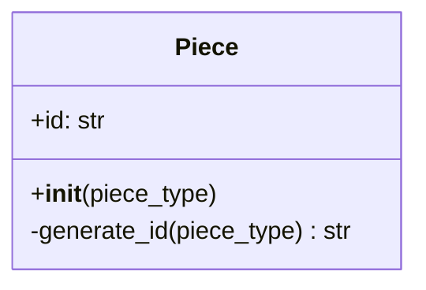
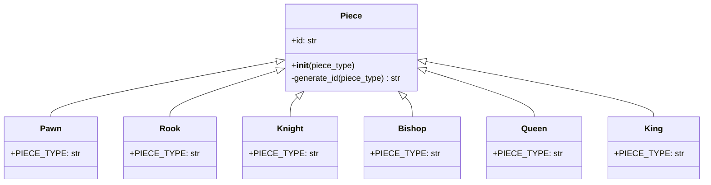

# Piece Class Design

## Purpose

`Piece` is the base class for every chess piece. It contains information and behavior that are universal to all pieces.

At this stage, the only universal instance field is `id`. The ID distinguishes pieces of the same type, such as multiple pawns, rooks, knights, bishops, or queens.

## ID format

Each ID combines the piece type with a randomly generated hexadecimal value:

```text
<piece-type>-<random-hex>
```

Examples:

```text
pawn-a3f91c20
rook-07bd42ef
knight-c218ea74
```

The examples use eight hexadecimal characters. In Python, that value can be generated with `secrets.token_hex(4)` because four random bytes produce eight hexadecimal characters.

The intended generation rule is:

classDiagram
    class Piece {
        +id: str
        +__init__(piece_type)
        -generate_id(piece_type) str
    }

    note for Piece "ID format: piece_type-random_hex"

## Detailed `Piece` class



- `id` is the generated identifier stored by every piece.
- `piece_type` is supplied during construction by the concrete piece class.
- `generate_id()` combines the normalized piece type, a hyphen, and random hexadecimal characters.
- The leading `-` marks `generate_id()` as an internal implementation method in the design.

## Piece inheritance hierarchy



Each concrete class inherits `id` and the ID-generation behavior from `Piece`. The concrete class supplies its own piece type, which becomes the first portion of the ID.

For example, constructing two pawns could produce:

```text
Pawn 1: pawn-a3f91c20
Pawn 2: pawn-94de017b
```

Both objects are pawns, but their random hexadecimal portions make their IDs distinct.