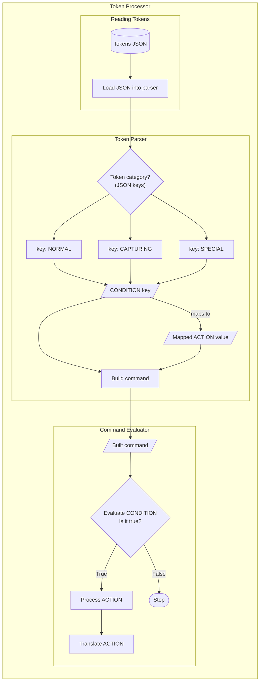

```mermaid
flowchart TB
    subgraph Processing["Token Processor"]
        direction TB

        subgraph Reading["Reading Tokens"]
            direction TB

            JSON[(Tokens JSON)]
            LOAD["Load JSON into parser"]

            JSON --> LOAD
        end

        subgraph Parser["Token Parser"]
            direction TB

            KEYS{"Token category?<br/>(JSON keys)"}

            NORMAL["key: NORMAL"]
            CAPTURING["key: CAPTURING"]
            SPECIAL["key: SPECIAL"]

            CONDITION[/"CONDITION key"/]
            ACTION_VALUE[/"Mapped ACTION value"/]

            BUILD_COMMAND["Build command"]

            KEYS --> NORMAL
            KEYS --> CAPTURING
            KEYS --> SPECIAL

            NORMAL --> CONDITION
            CAPTURING --> CONDITION
            SPECIAL --> CONDITION

            CONDITION -->|maps to| ACTION_VALUE

            CONDITION --> BUILD_COMMAND
            ACTION_VALUE --> BUILD_COMMAND
        end

        subgraph Command_Evaluator["Command Evaluator"]
            direction TB

            COMMAND[/"Built command"/]
            CHECK_CONDITION{"Evaluate CONDITION<br/>Is it true?"}
            PROCESS_ACTION["Process ACTION"]
            TRANSLATE["Translate ACTION"]
            STOP([Stop])

            COMMAND --> CHECK_CONDITION
            CHECK_CONDITION -->|True| PROCESS_ACTION
            CHECK_CONDITION -->|False| STOP
            PROCESS_ACTION --> TRANSLATE
        end

        LOAD --> KEYS
        BUILD_COMMAND --> COMMAND
    end
```