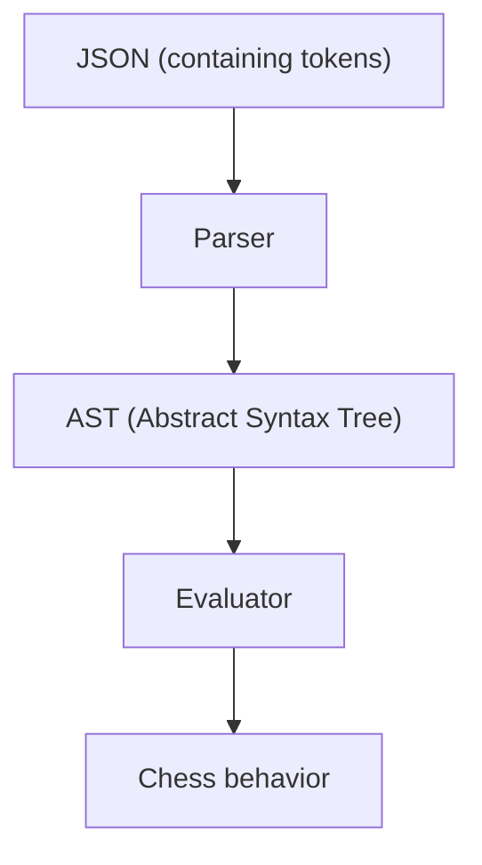

# Rough Overview

```mermaid
flowchart TD
    A["JSON (containing tokens)"] 
    
    A --> C["Parser"]    
    C --> D["AST (Abstract Syntax Tree)"]
    D --> E["Evaluator"]
    E --> F["Chess behavior"]
```