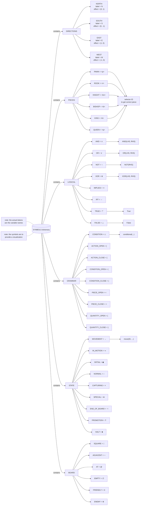

```mermaid
flowchart LR
    SYMBOLS[("SYMBOLS dictionary")]

    SYMBOLS -->|contains| DIRECTIONS["DIRECTIONS"]
    SYMBOLS -->|contains| PIECES["PIECES"]
    SYMBOLS -->|contains| LOGICAL["LOGICAL"]
    SYMBOLS -->|contains| GRAMMAR["GRAMMAR"]
    SYMBOLS -->|contains| STATE["STATE"]
    SYMBOLS -->|contains| BOARD["BOARD"]

    DIRECTIONS --> D_NORTH["NORTH<br/>label = N<br/>effect = (0, 1)"]
    DIRECTIONS --> D_SOUTH["SOUTH<br/>label = S<br/>effect = (0, -1)"]
    DIRECTIONS --> D_EAST["EAST<br/>label = E<br/>effect = (1, 0)"]
    DIRECTIONS --> D_WEST["WEST<br/>label = W<br/>effect = (-1, 0)"]

    PIECES --> P_PAWN["PAWN = &lt;p&gt;"] --> ID["selector ID<br/>to get correct piece"]
    PIECES --> P_ROOK["ROOK = &lt;r&gt;"] --> ID
    PIECES --> P_KNIGHT["KNIGHT = &lt;kn&gt;"] --> ID
    PIECES --> P_BISHOP["BISHOP = &lt;b&gt;"] --> ID
    PIECES --> P_KING["KING = &lt;k&gt;"] --> ID
    PIECES --> P_QUEEN["QUEEN = &lt;q&gt;"] --> ID

    LOGICAL --> L_AND["AND = ∧"] --> py_and["AND(LHS, RHS)"]
    LOGICAL --> L_OR["OR = ∨"] --> py_or["OR(LHS, RHS)"]
    LOGICAL --> L_NOT["NOT = ¬"] --> py_not["NOT(RHS)"]
    LOGICAL --> L_XOR["XOR = ⊕"] --> py_xor["XOR(LHS, RHS)"]
    LOGICAL --> L_IMPLIES["IMPLIES = ⇒"]
    LOGICAL --> L_IFF["IFF = ⇔"]
    LOGICAL --> L_TRUE["TRUE = ⊤"] --> py_true["True"]
    LOGICAL --> L_FALSE["FALSE = ⊥"] --> py_false["False"]

    GRAMMAR --> G_CONDITION["CONDITION = ◇"] --> conditional_func["conditional(...)"]
    GRAMMAR --> G_ACTION_OPEN["ACTION_OPEN = ["]
    GRAMMAR --> G_ACTION_CLOSE["ACTION_CLOSE = ]"]
    GRAMMAR --> G_CONDITION_OPEN["CONDITION_OPEN = ("]
    GRAMMAR --> G_CONDITION_CLOSE["CONDITION_CLOSE = )"]
    GRAMMAR --> G_PIECE_OPEN["PIECE_OPEN = &lt;"]
    GRAMMAR --> G_PIECE_CLOSE["PIECE_CLOSE = &gt;"]
    GRAMMAR --> G_QUANTITY_OPEN["QUANTITY_OPEN = {"]
    GRAMMAR --> G_QUANTITY_CLOSE["QUANTITY_CLOSE = }"]

    STATE --> S_MOVEMENT["MOVEMENT = →"] --> move_func["move(ID, ...)"]
    STATE --> S_IN_MOTION["IN_MOTION = ↝"]
    STATE --> S_INITIAL["INITIAL = ◉"]
    STATE --> S_NORMAL["NORMAL = ○"]
    STATE --> S_CAPTURING["CAPTURING = ×"]
    STATE --> S_SPECIAL["SPECIAL = ★"]
    STATE --> S_END_BOARD["END_OF_BOARD = ⊣"]
    STATE --> S_PROMOTION["PROMOTION = ⇑"]
    STATE --> S_HALT["HALT = ■"]

    BOARD --> B_SQUARE["SQUARE = □"]
    BOARD --> B_ADJACENT["ADJACENT = ∼"]
    BOARD --> B_AT["AT = @"]
    BOARD --> B_EMPTY["EMPTY = ∅"]
    BOARD --> B_FRIENDLY["FRIENDLY = ⊙"]
    BOARD --> B_ENEMY["ENEMY = ⊗"]
    
    note1["note: the actual tokens<br/> are the variable names"] -.- SYMBOLS
    note2["note: the symbols are to <br/>provide a visualization"] -.- SYMBOLS
```